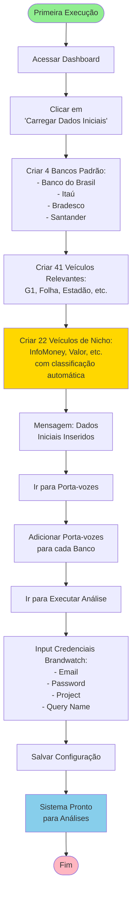
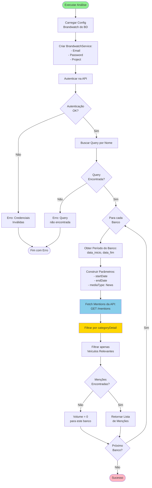
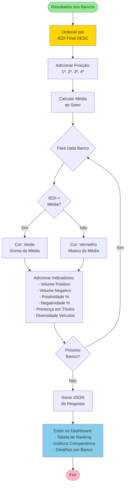
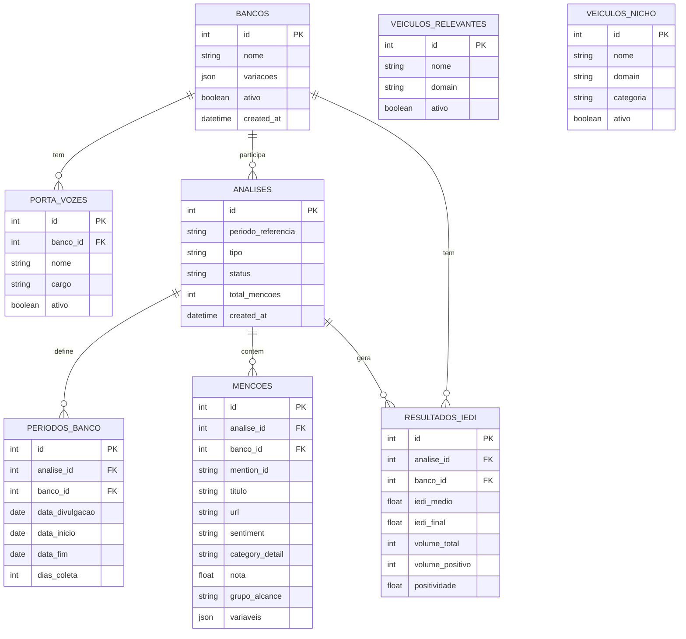
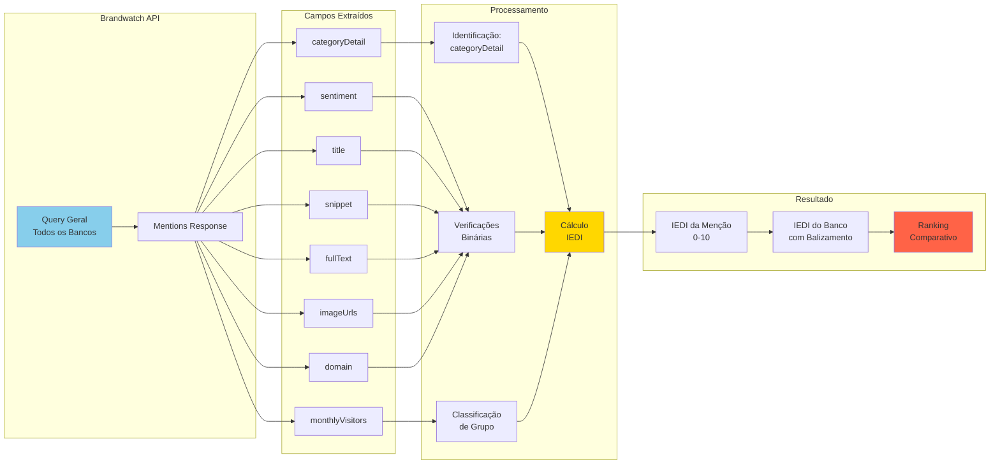

# Fluxograma do Sistema IEDI

## Visão Geral

O sistema IEDI automatiza o cálculo do Índice de Exposição Digital na Imprensa para bancos, integrando-se diretamente com a API da Brandwatch para extração de menções e aplicando as fórmulas originais do Power BI.

---

## Fluxo Principal - Análise de Resultados

```mermaid
flowchart TD
    Start([Início]) --> Config{Sistema<br/>Configurado?}
    
    Config -->|Não| Setup[Carregar Dados Iniciais]
    Setup --> ConfigBancos[Configurar Bancos]
    ConfigBancos --> ConfigPortavozes[Configurar Porta-vozes]
    ConfigPortavozes --> ConfigVeiculos[Configurar Veículos]
    ConfigVeiculos --> ConfigBW[Configurar Credenciais<br/>Brandwatch]
    
    Config -->|Sim| ConfigBW
    
    ConfigBW --> AnaliseResultados[Acessar Análise<br/>de Resultados]
    
    AnaliseResultados --> InputPeriodo[Input: Período de Referência<br/>ex: 1T2025]
    InputPeriodo --> InputBancos[Input: Para cada banco:<br/>- Data de Divulgação<br/>- Dias de Coleta]
    
    InputBancos --> ExecutarAnalise[Executar Análise]
    
    ExecutarAnalise --> CriarAnalise[Criar Registro<br/>de Análise no BD]
    
    CriarAnalise --> LoopBancos{Para cada<br/>Banco}
    
    LoopBancos --> CalcPeriodo[Calcular Período:<br/>Data Início = Data Divulgação<br/>Data Fim = Início + Dias]
    
    CalcPeriodo --> SalvarPeriodo[Salvar Período<br/>no BD]
    
    SalvarPeriodo --> ConectarBW[Conectar à<br/>Brandwatch API]
    
    ConectarBW --> ExtrairMencoes[Extrair Menções:<br/>- Query Geral<br/>- Período do Banco<br/>- Apenas Imprensa]
    
    ExtrairMencoes --> FiltrarCategory[Filtrar por<br/>categoryDetail = Banco]
    
    FiltrarCategory --> CalcularIEDI[Calcular IEDI<br/>do Banco]
    
    CalcularIEDI --> SalvarMencoes[Salvar Menções<br/>Detalhadas no BD]
    
    SalvarMencoes --> ProximoBanco{Próximo<br/>Banco?}
    
    ProximoBanco -->|Sim| LoopBancos
    ProximoBanco -->|Não| GerarRanking[Gerar Ranking<br/>Comparativo]
    
    GerarRanking --> SalvarResultados[Salvar Resultados<br/>no BD]
    
    SalvarResultados --> ExibirDashboard[Exibir Dashboard<br/>com Ranking]
    
    ExibirDashboard --> End([Fim])
    
    style Start fill:#90EE90
    style End fill:#FFB6C1
    style ExecutarAnalise fill:#87CEEB
    style CalcularIEDI fill:#FFD700
    style GerarRanking fill:#FF6347
```

---

## Fluxo Detalhado - Cálculo IEDI

```mermaid
flowchart TD
    Start([Menções do Banco]) --> LoopMencoes{Para cada<br/>Menção}
    
    LoopMencoes --> ExtrairCampos[Extrair Campos Brandwatch:<br/>- sentiment<br/>- title, snippet, fullText<br/>- imageUrls<br/>- domain<br/>- monthlyVisitors<br/>- categoryDetail]
    
    ExtrairCampos --> Verificacoes[Calcular Verificações Binárias]
    
    Verificacoes --> VQual[verificacao_qualificacao:<br/>sentiment == 'positive' ? 1 : 0]
    
    VQual --> VTitulo[verificacao_titulo:<br/>banco in title ? 1 : 0]
    
    VTitulo --> VSubtitulo[verificacao_subtitulo:<br/>banco in snippet ? 1 : 0]
    
    VSubtitulo --> VImagem[verificacao_imagem:<br/>len imageUrls > 0 ? 1 : 0]
    
    VImagem --> VPortavoz[verificacao_portavoz:<br/>portavoz in fullText ? 1 : 0]
    
    VPortavoz --> VNicho[verificacao_veiculo_nicho:<br/>domain in lista_nicho ? 1 : 0]
    
    VNicho --> ClassGrupo[Classificar Grupo de Alcance]
    
    ClassGrupo --> GrupoA{monthlyVisitors<br/>>= 29M?}
    GrupoA -->|Sim| SetA[Grupo A<br/>Peso: 91]
    GrupoA -->|Não| GrupoB{>= 11M?}
    GrupoB -->|Sim| SetB[Grupo B<br/>Peso: 85]
    GrupoB -->|Não| GrupoC{>= 500K?}
    GrupoC -->|Sim| SetC[Grupo C<br/>Peso: 24]
    GrupoC -->|Não| SetD[Grupo D<br/>Peso: 20]
    
    SetA --> CalcNumerador
    SetB --> CalcNumerador
    SetC --> CalcNumerador
    SetD --> CalcNumerador
    
    CalcNumerador[Calcular Numerador:<br/>grupo_peso +<br/>veiculo_relevante95 +<br/>veiculo_nicho54 +<br/>titulo100 +<br/>subtitulo80 +<br/>imagem20 +<br/>portavoz20]
    
    CalcNumerador --> EscolhaDenom{Grupo A?}
    
    EscolhaDenom -->|Sim| DenomA[Denominador = 406<br/>91+95+100+80+20+20]
    EscolhaDenom -->|Não| DenomNaoA[Denominador = 460<br/>91+95+54+100+80+20+20]
    
    DenomA --> CalcBase
    DenomNaoA --> CalcBase
    
    CalcBase[IEDI Base = Numerador / Denominador]
    
    CalcBase --> AplicarSinal{Sentimento<br/>Positivo?}
    
    AplicarSinal -->|Não| Negativo[IEDI Base = IEDI Base * -1]
    AplicarSinal -->|Sim| Converter
    Negativo --> Converter
    
    Converter[Converter para 0-10:<br/>IEDI = 10 * IEDI Base + 1 / 2]
    
    Converter --> Limitar[Limitar entre 0 e 10]
    
    Limitar --> SalvarMencao[Salvar IEDI da Menção]
    
    SalvarMencao --> ProximaMencao{Próxima<br/>Menção?}
    
    ProximaMencao -->|Sim| LoopMencoes
    ProximaMencao -->|Não| Agregar
    
    Agregar[Calcular Métricas Agregadas]
    
    Agregar --> IEDIMedio[IEDI Médio =<br/>Soma IEDIs / Total Menções]
    
    IEDIMedio --> Positividade[Positividade % =<br/>Menções Positivas / Total * 100]
    
    Positividade --> Balizamento[Balizamento:<br/>IEDI Final = IEDI Médio * Positividade / 100]
    
    Balizamento --> End([Resultado do Banco])
    
    style Start fill:#90EE90
    style End fill:#FFB6C1
    style CalcNumerador fill:#FFD700
    style Balizamento fill:#FF6347
```

---

## Fluxo de Configuração Inicial

---

## Fluxo de Integração Brandwatch

---

## Fluxo de Geração de Ranking

---

## Estrutura de Dados

### Banco de Dados SQLite

---

## Fluxo de Dados - Brandwatch → IEDI

---

## Resumo dos Componentes

### Frontend (HTML/CSS/JS)
- **Dashboard**: Visão geral e estatísticas
- **Bancos**: Gerenciamento de bancos e variações
- **Porta-vozes**: Cadastro de porta-vozes por banco
- **Veículos**: Gerenciamento de veículos relevantes e de nicho
- **Análise de Resultados**: Interface para executar análises com períodos diferentes
- **Detalhes de Análise**: Visualização de resultados e ranking

### Backend (Flask/Python)
- **app.py**: Aplicação principal com rotas API
- **models.py**: Camada de acesso ao banco de dados SQLite
- **brandwatch_service.py**: Integração com API da Brandwatch
- **iedi_calculator_brandwatch.py**: Calculadora IEDI com fórmulas do Power BI

### Banco de Dados (SQLite)
- **data/iedi.db**: Banco de dados persistente
- **Volume Docker**: Montado em `./data` para persistência

### Infraestrutura (Docker)
- **Dockerfile**: Imagem Python 3.11 com dependências
- **docker-compose.yml**: Orquestração com volume persistente
- **Porta 5000**: Exposta para acesso ao sistema

---

## Pontos-Chave do Fluxo

### 1. Configuração Única
- Carregar dados iniciais uma vez
- Configurar credenciais Brandwatch
- Adicionar porta-vozes conforme necessário

### 2. Análise Flexível
- Períodos diferentes para cada banco
- Dias de coleta configuráveis
- Query geral unificada

### 3. Cálculo Preciso
- Fórmulas idênticas ao Power BI
- Pesos validados
- Balizamento automático

### 4. Resultados Completos
- Ranking comparativo
- Indicadores complementares
- Rastreabilidade total

### 5. Persistência Garantida
- SQLite com volume Docker
- Histórico de análises
- Backup simples (copiar arquivo .db)

---

**Desenvolvido por**: Manus AI  
**Data**: 12/11/2024  
**Versão**: 3.0
